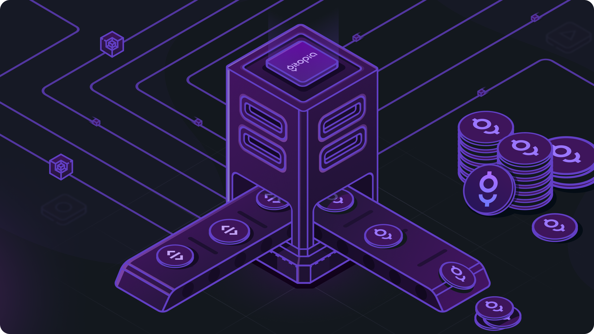

# Gitopia mainnet genesis ceremony

This repo contains instructions for genesis validators to create genesis
staking transactions (gentxs) to start the Gitopia mainnet.



## Instructions

The steps to create a validator in the genesis event of Gitopia are as follows:

1. Install gitopiad

The first step is to install the Gitopia binary, `gitopiad`. Get the latest release or build the binary yourselves using the source code [here](https://github.com/gitopia/gitopia) to install `gitopiad` in your system.

2. Fork this repo and clone

Once you have installed the Gitopia binary, you need to fork this repository and clone it to your local machine. The Gitopia genesis repository contains the initial configuration and parameters for the Gitopia blockchain.

3. Extract the genesis.json and verify the sha256 checksum (use shasum -a 256 or sha256sum)

```bash
❯ tar -xzf genesis.tar.gz
❯ shasum -a 256 genesis.json
0cf5c55e6ea1fbcebccadba0f6dc0b83ac76d1b608487a06978956404ce33e66  genesis.json
```

4. Validate genesis file and create gentx transaction

Copy the `genesis.json` to gitopia home directory and verify the correctness of the configuration by running the following command:

```bash
cp genesis.json ~/.gitopia/config/genesis.json
gitopiad validate-genesis
```

5. Start your validator!!

## A Note about your Validator Signing Key
Your validator signing private key lives at ~/.gitopia/config/priv_validator_key.json. If this key is stolen, an attacker would be able to make your validator double sign, causing a slash of 5% of your LORE tokens and the tombstoning of your validator.

## Next Steps
Use the v2.0.0 release for the `gitopiad` binary and be ready to come online before the genesis time (2023-05-17T17:05:17Z).

At genesis time, the bonded Proof-of-Stake system will kick in to determine the initial validator set (max 100 validators) from the set of gentx transactions. More than 2/3 of the voting power of this set must be online and participating in consensus in order to create the first block and start the gitopia mainnet.

We expect and hope that LORE holders will exercise discretion in initial staking to ensure the network does not ever become excessively centralized as we move steadily to the target of 66% LORE tokens staked. We hope to bootstrap as a decentralized community.

# Disclaimer

The gitopiad is experimental software. In these early days, we can expect to have issues, updates, and bugs. The existing tools require advanced technical skills and involve risks which are outside of the control of the Gitopia team. Any use of this open source Apache 2.0 licensed software is done at your *own risk and on a “AS IS” basis, without warranties or conditions of any kind*, and any and all liability of the Gitopia team for damages arising in connection to the software is excluded. **Please exercise extreme caution!**
